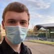

# Open Source Software - Summer 2022
## William Allen

## Bio
 Hi there!  I'm currently finishing my second to last semester at
RPI.  I'm primarily interested in complex networks and high-performance computing.
I also work on [Submitty](https://submitty.org) in my free time, with a focus on
plagiarism detection.  I believe that clean code is important and I'm obsessed
with static analysis, linting, and strict formatting rules.  

Feel free to contact me on Discord: @dalearn#5106 or via email: allenw@rpi.edu.

## Lab Reports
[Lab 1](labs/lab-01/report.md)
