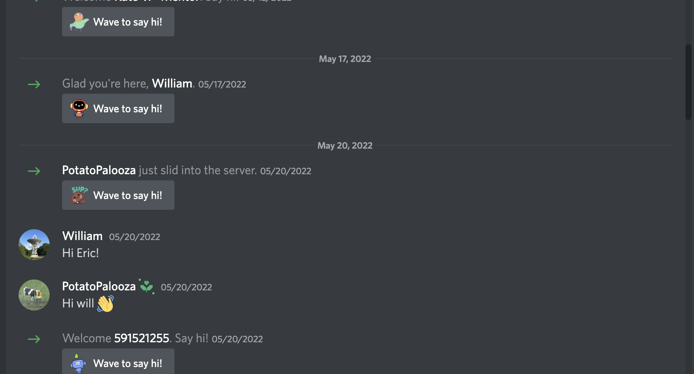
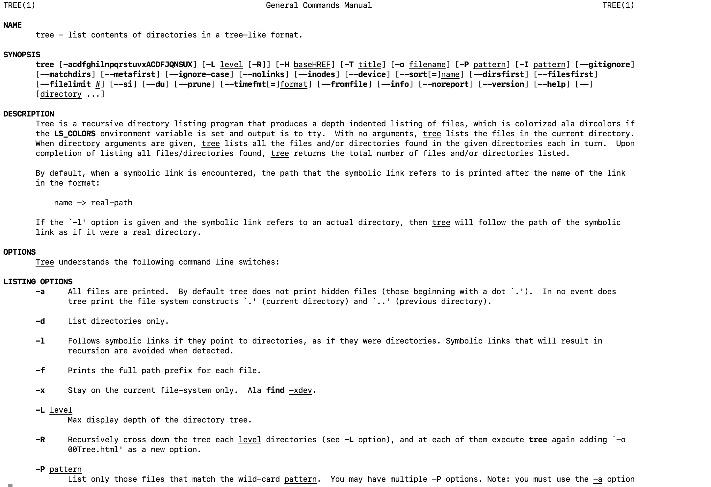
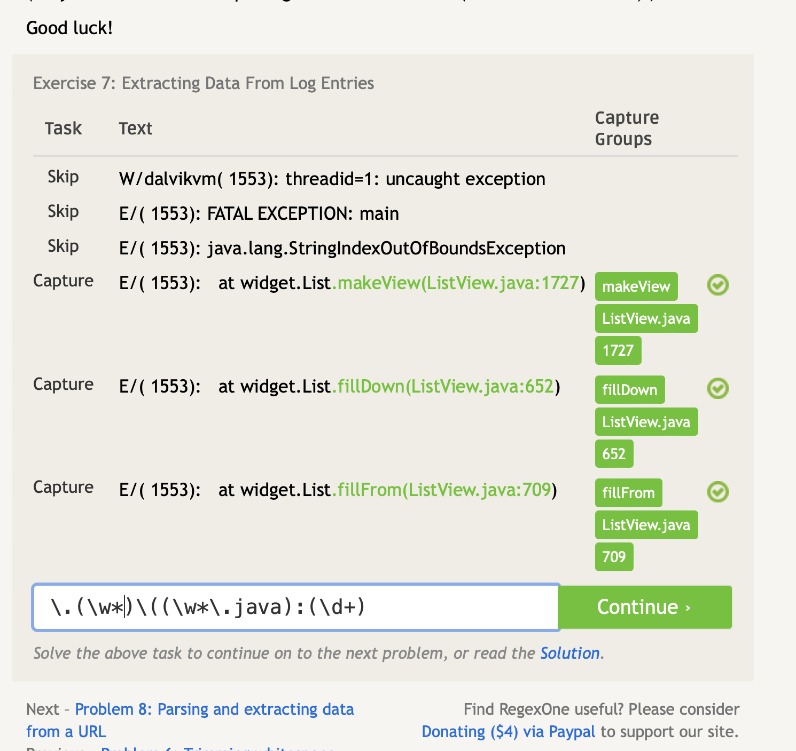
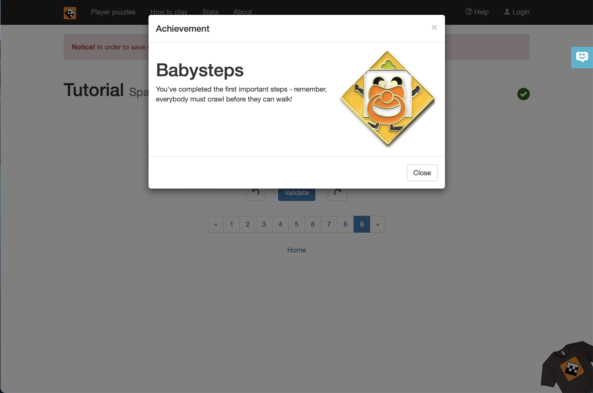
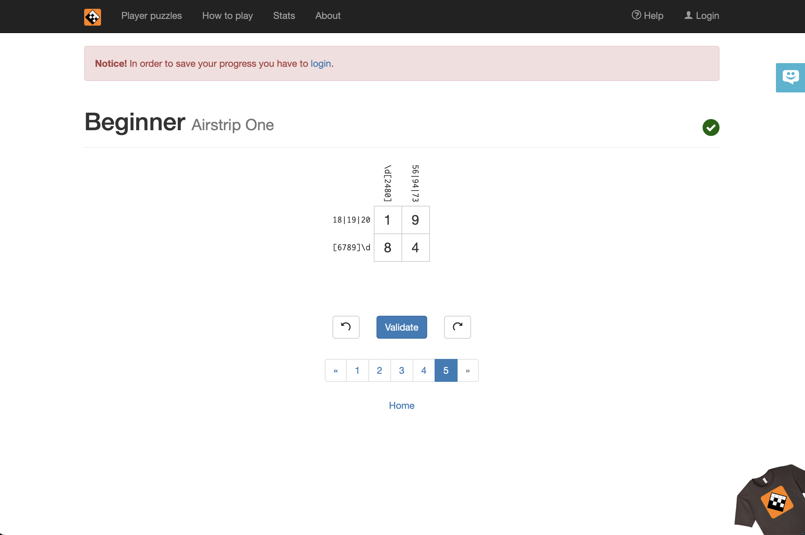
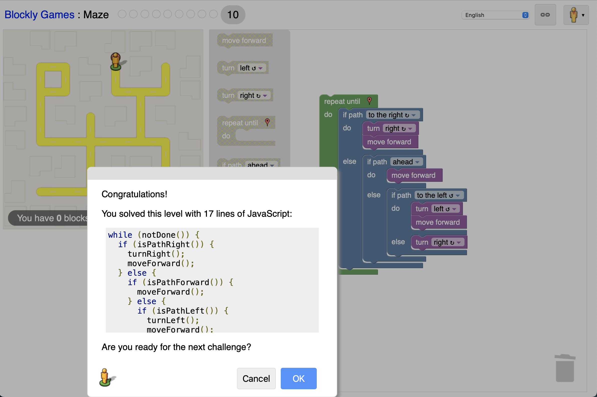

# Lab 01 Report - Introduction to Open Source Software

## Introduction
The first lab of the semester involved setting up a variety of software for usage during the rest of the class and beyond.  In addition, a number of readings were completed.

A screenshot of my participation in the course Discord server is included below.

## Reading reflections

Eric Raymond's article [Smart Questions - How to ask the question The Smart Way](http://www.catb.org/esr/faqs/smart-questions.html) discusses the author's complaints about individuals who ask poor-quality questions and provides a set of better approaches to asking and answering questions effectively in technical settings.  The entire document is a good read for anyone hoping to do any sort of programming work, and also for those who maintain projects.  In addition to the list of suggestions for how to answer questions in a helpful way, I have personally found that it is helpful to include links to external documentation, protocols, or best practices when answering beginner questions.  That way, the questioner has the opportunity to learn not only about the specific problem they are facing, but also about related problems or features that may be helpful in the future.  In addition, I have found that it is often helpful, both when asking and answering questions, to consider the underlying problem that is to be solved, not just the technical details necessary to solve it.  If someone isn't sure how to solve a problem due to some kind of technical blocker, it's likely that there is a better technical way to accomplish the same task.

Chapter 3 of [Free Culture](https://github.com/rcos/CSCI-4470-OpenSource/blob/master/Resources/freeculture.pdf) discusses a lawsuit filed by the Recording Industry Association of America (RIAA) against Jesse Jordan, a student at RPI in the early 2000s, in response to his work to modify an existing search engine to be able to search files on the campus network.  Similar lawsuits were filed against three other students at institutions of similar academic standing.  The RIAA is a powerful group which lobbies on behalf of a collection of the largest music producers in the United States.  The lawsuit was filed by the RIAA against Jesse Jordan under a series of anti-piracy laws due to the inadvertent cataloging of music files but the author of the book is of the opinion that Jesse did nothing wrong.  This is a cautionary story which shows why it is important to be aware of the legal considerations involved when writing any piece of software.  In this case, common sense says that Jesse did nothing wrong, and certainly wasn't maliciously trying to make music available.  None the less, the law was possibly overly broad and Jesse ran afoul of anti-piracy laws at the cost of a $12,000 settlement.  Aside from the specific questions raised from the story itself, it also brings up good questions about the morality of extra-judicial settlements between individuals and well-financed groups when the potential cost of a full lawsuit is large in even the best case.  This is a common tactic used by industry groups as well as government agencies such as the EPA, FCC, FTC, and others, and usually involves taking all of a person's property without any realistic possibility of a case being fairly considered before a jury due to the financial burden of a lawsuit.

## Linux

A portion of this lab was dedicated to setting up a Linux environment for use later in this course.  The `grep` command was used as part of a regex exercise.  Even though I have used `grep` in the past, I found the exercise to be quite insightful and potentially beneficial in the future.  The `tree` utility was also installed.  I was not aware of the usefulness of the `tree` utility before this lab and greatly appreciated being introduced to its use.  I have included a screenshot of the manpages for the `tree` command below as per the instructions for this exercise.  

## Regex

A large portion of this lab focused on the usage of Regular Expressions.  I have used them in the past for a variety of tasks, but this was the first time I put a significant amount of time into learning more than the very basics.  The problems provided were useful in helping me learn the basics.  Due to a misunderstanding of the directions, only a screenshot of the final problems of each exercise was collected.  These screenshots have been listed below.

## Playing with Blockly

I was a very active user of the [Scratch](https://scratch.mit.edu) community until well into high school, including for a significant amount of time after I become proficient with multiple text-based programming languages.  It has been a few years since I was last active so I enjoyed getting to play with [Blockly](https://blockly-games.appspot.com/).  A screenshot of my successful program follows:

## Reflection

I am currently an active [Submitty](https://submitty.org) developer so the obvious choice for this evaluation is Submitty.  I am also quite interested in the [NetworkX](https://networkx.org) project and would like to dig into their community structure further.  It is difficult to choose a single project since there are a large number of incredible open source projects out there, so the two criteria I used are:
  1. The project's applicability to my everyday life
  2. The community's culture

Both Submitty and NetworkX have a decent project culture and I use both of them on a near-daily basis.  As such, they seem like good candidates for my project evaluation.
