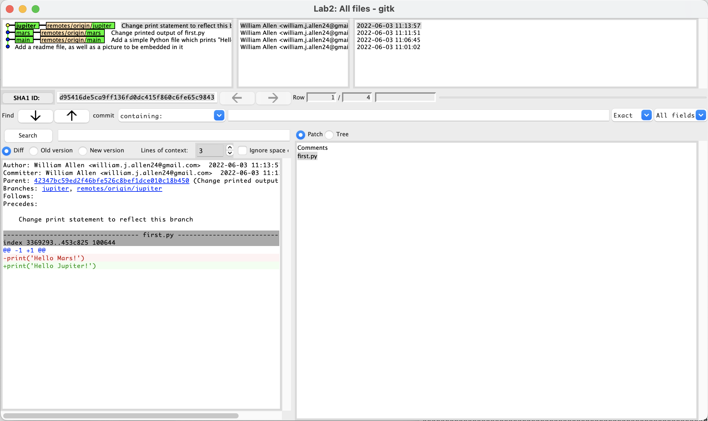
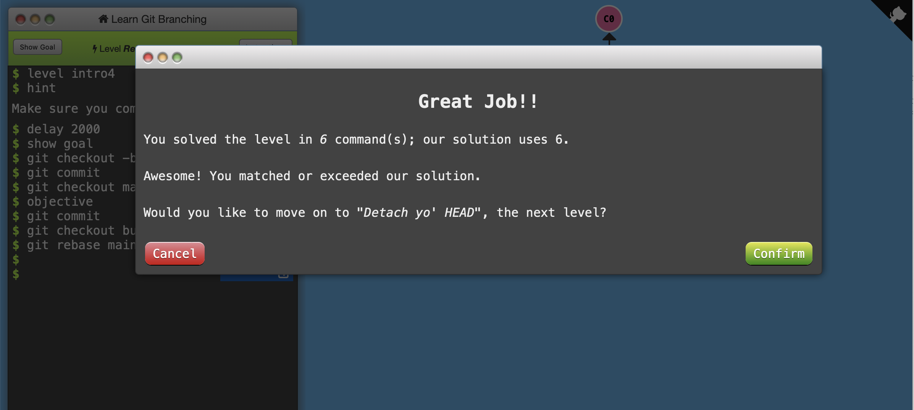
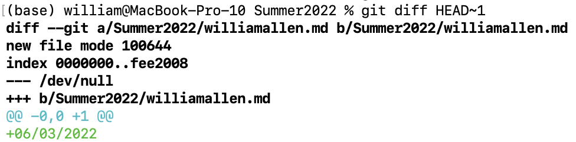
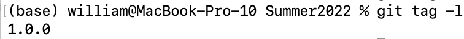

# Lab 2

## Part 1

A [repository](https://github.com/williamjallen/OSS_Lab2_Repo) was created on GitHub for this lab.  This repository was used for teaching basic Git commands.  Three branches were created and are shown in the following screenshot.

## Part 2

A [repository](https://github.com/octocat/Spoon-Knife) commonly used for teaching Git was forked to create [my own fork](https://github.com/williamjallen/Spoon-Knife).  A short file was added to my fork, detailing my thoughts on possible projects and organization strategies.

As a final exercise for Part 2, a few basic lessons from [Learn Git Branching](http://pcottle.github.io/learnGitBranching/) were completed. I completed many of the lessons in the aforementioned course some time ago but it was a good refresher, since I don't often use the command-line for everyday usage of Git.  A screenshot indicating my progress is shown below.

## Part 3

The example Pull Request repository was [forked](https://github.com/williamjallen/PullReq) and a file with my name and the date was committed.  A pull request was then created and merged into the [original repository](https://github.com/wdturner/PullReq).  A `diff` of the changes is attached below.

The commit was then tagged.  The output of `git tag -l` is shown below.

As a final step, Eric created a fork of [this](https://github.com/wdturner/OSSProjectIdeas.git) repository and added the members of the Table 1 group as collaborators on GitHub.  Each member of the group then cloned the repository locally and listed our intended project in the relevant file.  Each member then pushed to the common repository and Eric made a pull request to the upstream repository.
