# Lab 3

## Part 1 -- Documentation

1. N/A

2. A [wiki](https://github.com/williamjallen/OSS_Summer_2022/wiki) was created for this repository and the required information was entered.

3. LaTeX was used to render [this](https://github.com/rcos/CSCI-4470-OpenSource/blob/master/Modules/03.DocumentationAndCommunity/latex_formulae.png) formula:
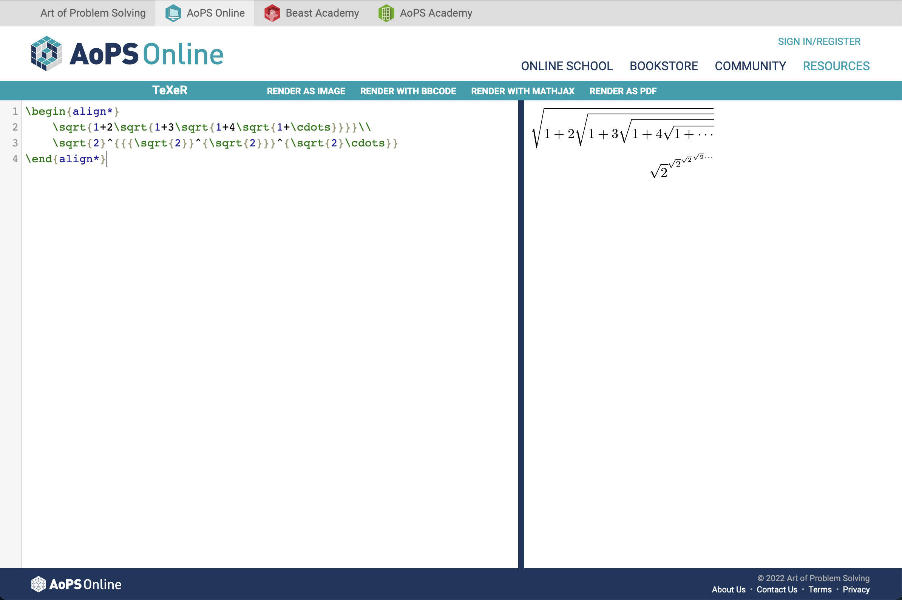

4. LaTeX was used to render a Hadamard Matrix of size 4:
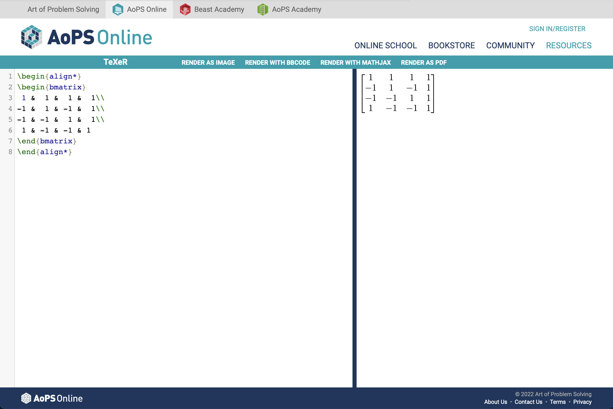

5. This part of the lab required students to use a working LaTeX installation to compile the notes for the first module.  Below is a screenshot of my successful `make` output.  `make` wrote the output files to `/Users/william/Desktop/RPI/Courses/Open Source Software/CSCI-4470-OpenSource/Modules/01.Introduction/History/build/latex`.
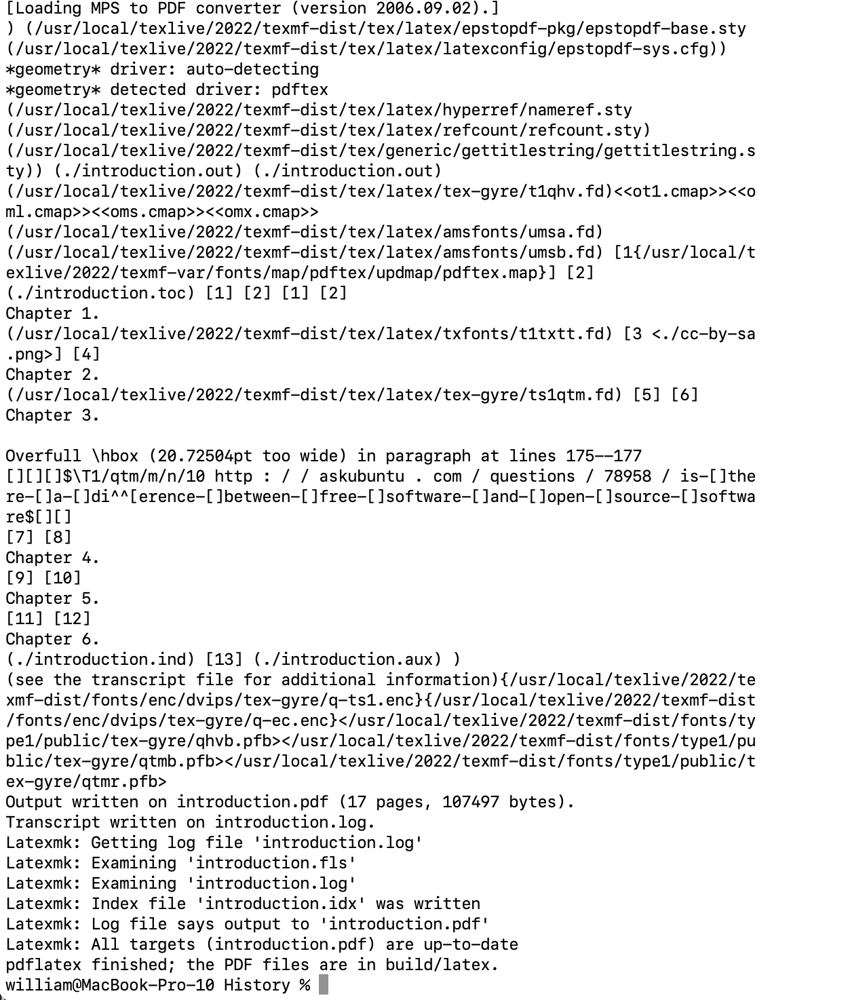

## Part 2 -- Community

1. N/A

2. A number of past RCOS projects were chosen for analysis.  Each member of Table 1 chose a different project as follows:
  - William: CodeBuddy
  - Eric: ALPACA
  - Michael: FloatingTwitch
  - Weiting: Animate.css

3. Each member of Table reported the following details about their selected project:
  - CodeBuddy:
    - 3 contributors
    - 1336 lines of code
    - [First commit](https://github.com/didioj/CodeBuddy/commit/11ffbb404a02fe65794baeb56bc38734a64138ac)
    - [Latest commit](https://github.com/didioj/CodeBuddy/commit/ef224c682f118c3257cbd7e8ea27fe50c47ee834)
    - Branch names: `master`, `add-code-of-conduct-1`
  - ALPACA:
    - 15 contributors
    - 7205 lines of code
    - [First commit](https://github.com/rpi-alpaca/alpaca/commit/a8b820a9c12f26ee5861a3cd511dd36805705468)
    - [Latest commit](https://github.com/rpi-alpaca/alpaca/commit/550d1c4f06c0697f5c9e638a98cce34bb2fa5fee)
    - Branch names: `master`, `color_test`, `LogicGate`
  - Floating Twitch:
    - 1 contributor
    - 300 lines of code
    - [First commit](https://github.com/fcusano9/FloatingTwitch/commit/8ae1d065a505a3baeb4bc77eeb61c3f474c81270)
    - [Latest commit](https://github.com/fcusano9/FloatingTwitch/commit/0e0289a7ea4a60822a5c44903586976909ede17f)
    - Branch names: `master`, `dev`
  - Animate.css
    - 65 contributors
    - 3916 lines of code
    - [First commit](https://github.com/animate-css/animate.css/commit/8a2380e7de3a083a4e453e7f46f29d9d10f44d43)
    - [Latest commit](https://github.com/animate-css/animate.css/commit/61d13bad4b0bd42b2f3b3d6951872135df896e72)
    - Branch names: `master`, `sass`, `gh-pages`, `de-dist-directory`

4. The `gitstats` utility was run on each of the projects selected by the members of my table.  This tool provides a number of interesting metrics and visualizations, but the number of lines of code reported by the tool seems to differ wildly from the number reported by the command `git ls-files -z | xargs -0 wc -l` suggested in the lab handout.  On the activity page, the list of authors seems to be somewhat broken.  Some authors with substantial contributions are left out of the ranking.  Text under the activity table states "these didn't make it to the top", but that list does not change when the sorting is changed, and the default ordering seems to be reverse-alphabetic.  A screenshot of the `gitstats` summary for each of the projects is included below.
In addition to the required work, I also browsed through the source code for `gitstats`.  There are many issues with the project in my opinion, but one particular complaint is the lack of commenting in the code, as well as hardcoded HTML generation.
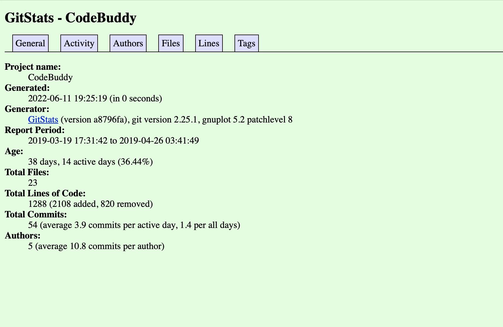
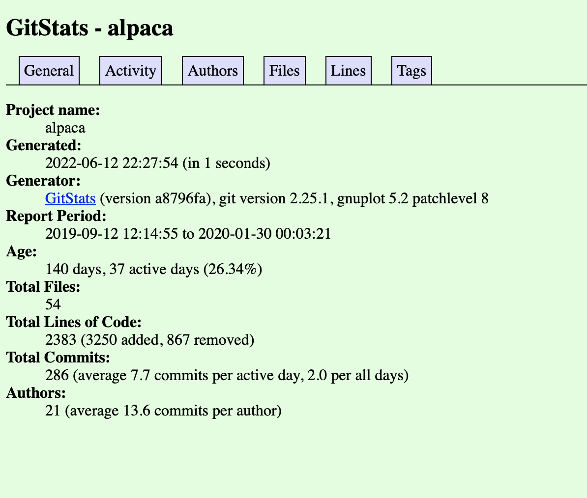
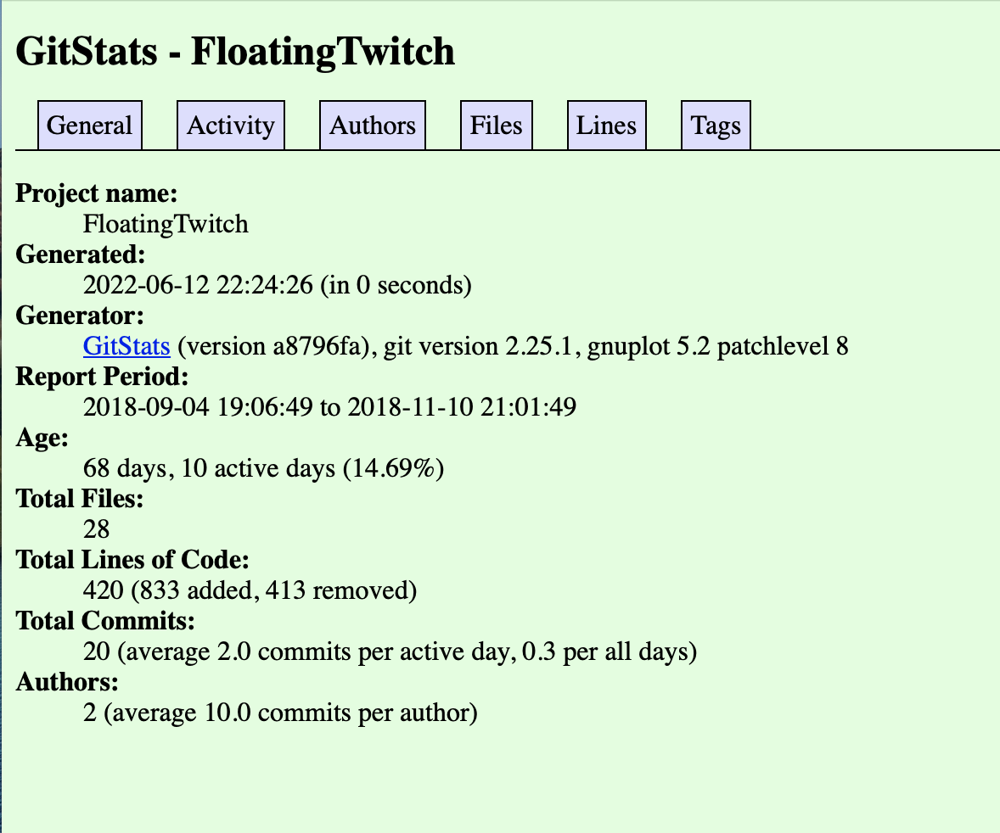
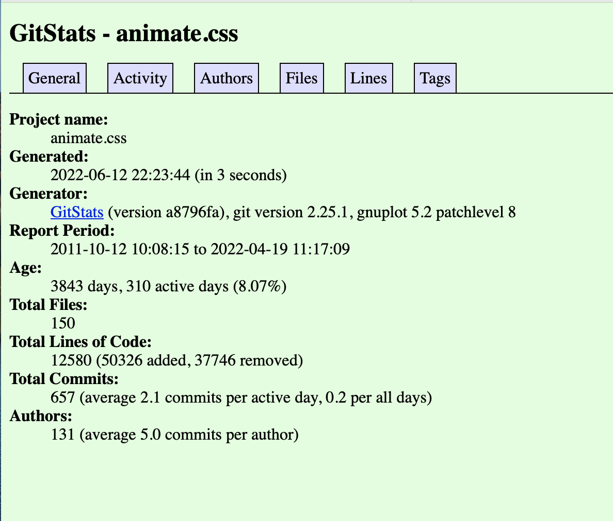

5. The `gource` utility was used to create an animation showing the directory structure of a Git repository over time as contributors add and remove content.  Screenshots of the current state of each of the projects chosen by our table are included below.
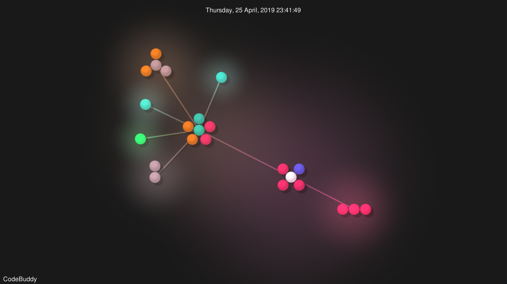
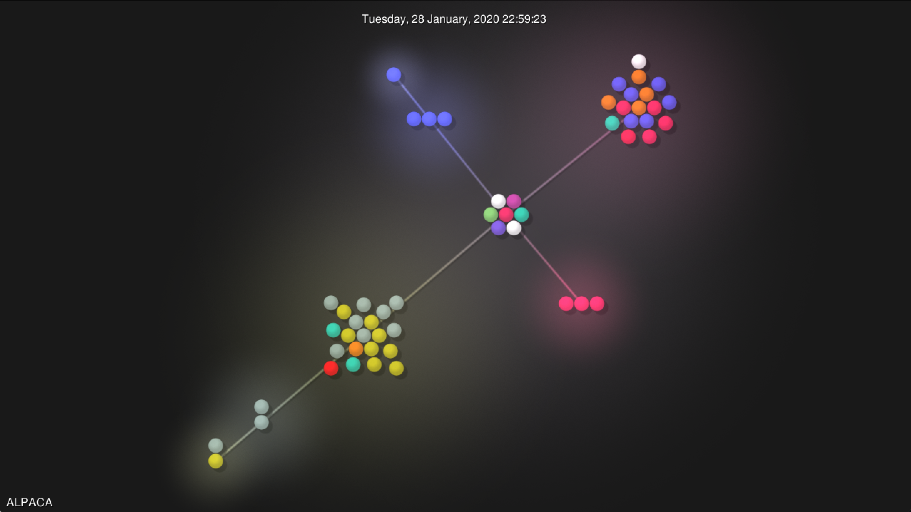
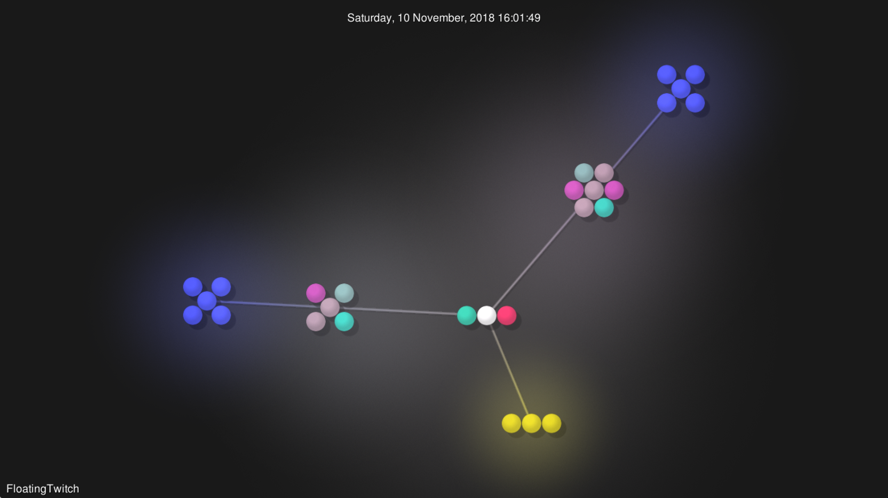
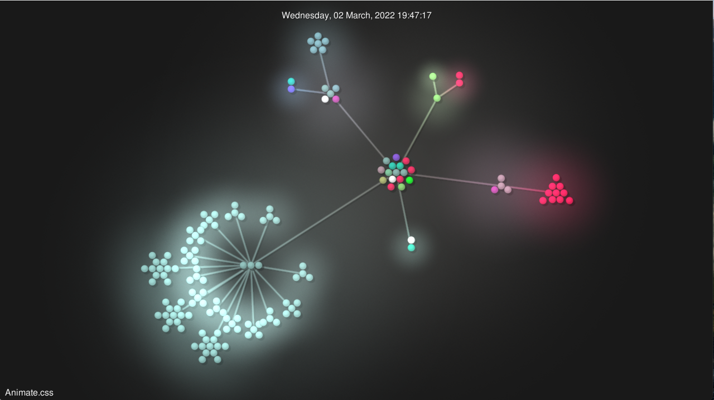
