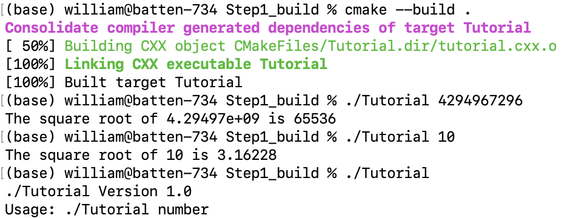
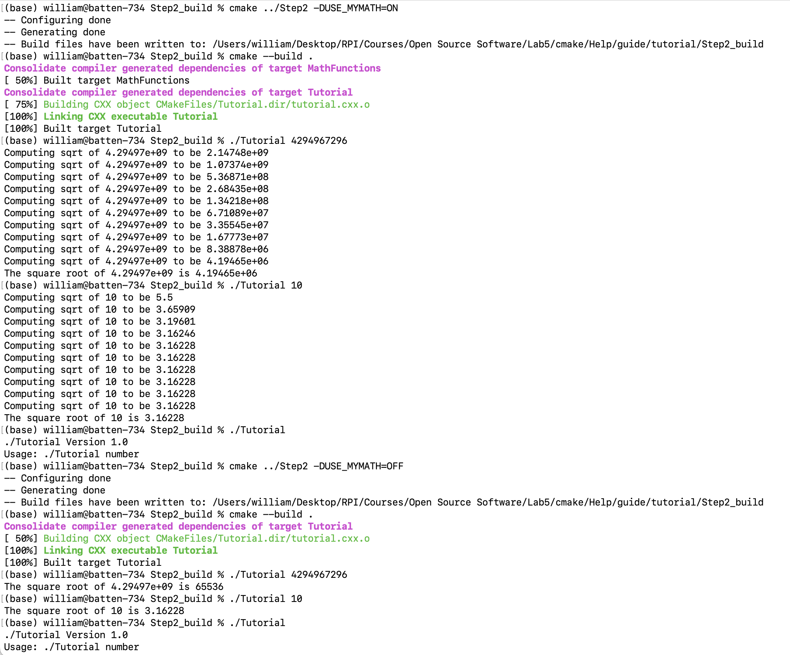
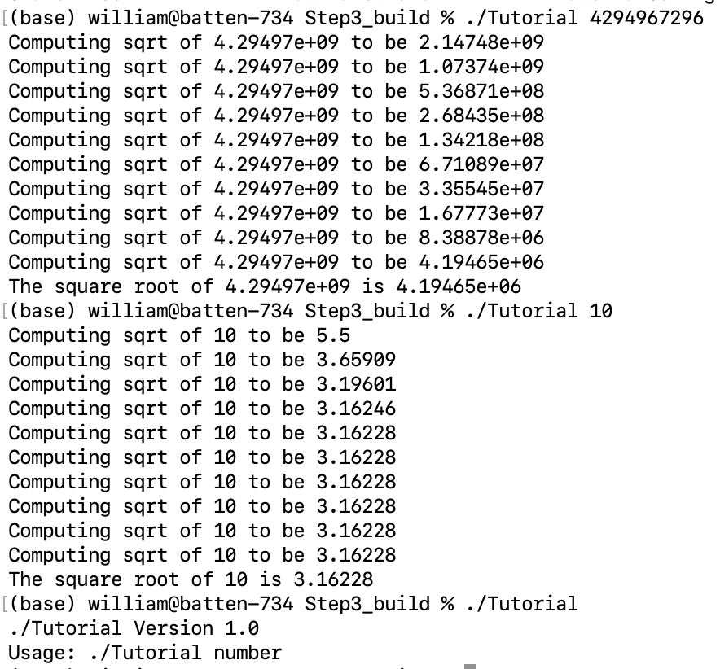
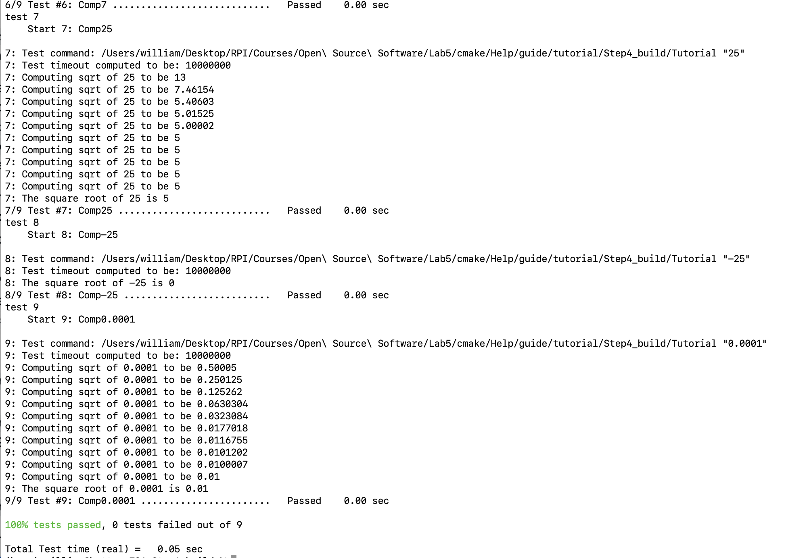
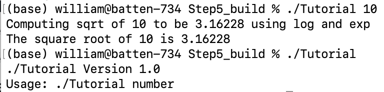
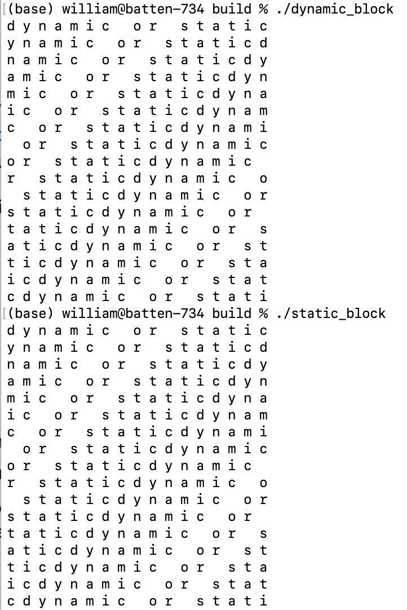

# Lab 5

This lab focused on build systems.  Prior to this lab, I was somewhat familiar with Make, and had tinkered with CMake minimally.  I did not have CMake installed locally on my machine, so the first step was to install it.  The CMake tutorial was then completed.  The required information regarding the CMake tutorial is included below.


## CMake Tutorial Part 1

`tutorial.cxx`:
```cpp
  // A simple program that computes the square root of a number
  #include <cmath>
  #include <iostream>
  #include <string>
  #include "TutorialConfig.h"

  int main(int argc, char* argv[])
  {
    if (argc < 2) {
      // report version
      std::cout << argv[0] << " Version " << Tutorial_VERSION_MAJOR << "."
                << Tutorial_VERSION_MINOR << std::endl;
      std::cout << "Usage: " << argv[0] << " number" << std::endl;
      return 1;
    }

    // convert input to double
    const double inputValue = std::stod(argv[1]);

    // calculate square root
    const double outputValue = sqrt(inputValue);
    std::cout << "The square root of " << inputValue << " is " << outputValue
              << std::endl;
    return 0;
  }
```

`TutorialConfig.h.in`:
```cpp
  // the configured options and settings for Tutorial
  #define Tutorial_VERSION_MAJOR @Tutorial_VERSION_MAJOR@
  #define Tutorial_VERSION_MINOR @Tutorial_VERSION_MINOR@
```

`CMakeLists.txt`:
```
  cmake_minimum_required(VERSION 3.10)

  # set the project name
  project(Tutorial VERSION 1.0)

  # specify the C++ standard
  set(CMAKE_CXX_STANDARD 11)
  set(CMAKE_CXX_STANDARD_REQUIRED True)

  configure_file(TutorialConfig.h.in TutorialConfig.h)

  # add the executable
  add_executable(Tutorial tutorial.cxx)

  target_include_directories(Tutorial PUBLIC "${PROJECT_BINARY_DIR}")
```

After making the specified changes, the project was built and run, and the following output was recorded:



## CMake Tutorial Part 2

`tutorial.cxx`:
```c
  // A simple program that computes the square root of a number
  #include <cmath>
  #include <iostream>
  #include <string>
  #include "TutorialConfig.h"

  #ifdef USE_MYMATH
  #include "MathFunctions.h"
  #endif

  int main(int argc, char* argv[])
  {
    if (argc < 2) {
      // report version
      std::cout << argv[0] << " Version " << Tutorial_VERSION_MAJOR << "."
                << Tutorial_VERSION_MINOR << std::endl;
      std::cout << "Usage: " << argv[0] << " number" << std::endl;
      return 1;
    }

    // convert input to double
    const double inputValue = std::stod(argv[1]);

    // calculate square root
  #ifdef USE_MYMATH
    const double outputValue = mysqrt(inputValue);
  #else
    const double outputValue = sqrt(inputValue);
  #endif
    std::cout << "The square root of " << inputValue << " is " << outputValue
              << std::endl;
    return 0;
  }
```

`TutorialConfig.h.in`:
```cpp
  #cmakedefine USE_MYMATH

  // the configured options and settings for Tutorial
  #define Tutorial_VERSION_MAJOR @Tutorial_VERSION_MAJOR@
  #define Tutorial_VERSION_MINOR @Tutorial_VERSION_MINOR@
```

`CMakeLists.txt`:
```
  cmake_minimum_required(VERSION 3.10)

  # set the project name and version
  project(Tutorial VERSION 1.0)

  # specify the C++ standard
  set(CMAKE_CXX_STANDARD 11)
  set(CMAKE_CXX_STANDARD_REQUIRED True)

  option(USE_MYMATH "Use tutorial provided math implementation" ON)

  # configure a header file to pass some of the CMake settings
  # to the source code
  configure_file(TutorialConfig.h.in TutorialConfig.h)

  if(USE_MYMATH)
    add_subdirectory(MathFunctions)
    list(APPEND EXTRA_LIBS MathFunctions)
    list(APPEND EXTRA_INCLUDES "${PROJECT_SOURCE_DIR}/MathFunctions")
  endif()

  # add the executable
  add_executable(Tutorial tutorial.cxx)

  target_link_libraries(Tutorial PUBLIC ${EXTRA_LIBS})

  # add the binary tree to the search path for include files
  # so that we will find TutorialConfig.h
  target_include_directories(Tutorial PUBLIC
                             "${PROJECT_BINARY_DIR}"
                             ${EXTRA_INCLUDES}
                             )
```

Program output:



## CMake Tutorial Part 3

`CMakeLists.txt`:
```
  cmake_minimum_required(VERSION 3.10)

  # set the project name and version
  project(Tutorial VERSION 1.0)

  # specify the C++ standard
  set(CMAKE_CXX_STANDARD 11)
  set(CMAKE_CXX_STANDARD_REQUIRED True)

  # should we use our own math functions
  option(USE_MYMATH "Use tutorial provided math implementation" ON)

  if(USE_MYMATH)
    add_subdirectory(MathFunctions)
    list(APPEND EXTRA_LIBS MathFunctions)
  endif()

  # configure a header file to pass some of the CMake settings
  # to the source code
  configure_file(TutorialConfig.h.in TutorialConfig.h)

  # add the executable
  add_executable(Tutorial tutorial.cxx)

  target_link_libraries(Tutorial PUBLIC ${EXTRA_LIBS})

  target_include_directories(Tutorial PUBLIC
                             "${PROJECT_BINARY_DIR}"
                             )
```

`MathFunctions/CMakeLists.txt`:
```
  add_library(MathFunctions mysqrt.cxx)

  target_include_directories(MathFunctions
            INTERFACE ${CMAKE_CURRENT_SOURCE_DIR}
            )
```

Program output:



## CMake Tutorial Part 4

`CMakeLists.txt`:
```
  cmake_minimum_required(VERSION 3.10)

  # set the project name and version
  project(Tutorial VERSION 1.0)

  # specify the C++ standard
  set(CMAKE_CXX_STANDARD 11)
  set(CMAKE_CXX_STANDARD_REQUIRED True)

  # should we use our own math functions
  option(USE_MYMATH "Use tutorial provided math implementation" ON)

  # configure a header file to pass some of the CMake settings
  # to the source code
  configure_file(TutorialConfig.h.in TutorialConfig.h)

  # add the MathFunctions library
  if(USE_MYMATH)
    add_subdirectory(MathFunctions)
    list(APPEND EXTRA_LIBS MathFunctions)
  endif()

  # add the executable
  add_executable(Tutorial tutorial.cxx)

  target_link_libraries(Tutorial PUBLIC ${EXTRA_LIBS})

  # add the binary tree to the search path for include files
  # so that we will find TutorialConfig.h
  target_include_directories(Tutorial PUBLIC
                             "${PROJECT_BINARY_DIR}"
                             )


  install(TARGETS Tutorial DESTINATION bin)
  install(FILES "${PROJECT_BINARY_DIR}/TutorialConfig.h"
    DESTINATION include
    )

  enable_testing()

  # does the application run
  add_test(NAME Runs COMMAND Tutorial 25)

  # does the usage message work?
  add_test(NAME Usage COMMAND Tutorial)
  set_tests_properties(Usage
    PROPERTIES PASS_REGULAR_EXPRESSION "Usage:.*number"
    )

  # define a function to simplify adding tests
  function(do_test target arg result)
    add_test(NAME Comp${arg} COMMAND ${target} ${arg})
    set_tests_properties(Comp${arg}
      PROPERTIES PASS_REGULAR_EXPRESSION ${result}
      )
  endfunction()

  # do a bunch of result based tests
  do_test(Tutorial 4 "4 is 2")
  do_test(Tutorial 9 "9 is 3")
  do_test(Tutorial 5 "5 is 2.236")
  do_test(Tutorial 7 "7 is 2.645")
  do_test(Tutorial 25 "25 is 5")
  do_test(Tutorial -25 "-25 is (-nan|nan|0)")
  do_test(Tutorial 0.0001 "0.0001 is 0.01")
```

`MathFunctions/CMakeLists.txt`:
```
  add_library(MathFunctions mysqrt.cxx)

  # state that anybody linking to us needs to include the current source dir
  # to find MathFunctions.h, while we don't.
  target_include_directories(MathFunctions
            INTERFACE ${CMAKE_CURRENT_SOURCE_DIR}
            )

  install(TARGETS MathFunctions DESTINATION lib)
  install(FILES MathFunctions.h DESTINATION include)
```

Result after running `ctest -VV`:



## CMake Tutorial Part 5

`CMakeLists.txt`:
```
  cmake_minimum_required(VERSION 3.10)

  # set the project name and version
  project(Tutorial VERSION 1.0)

  # specify the C++ standard
  set(CMAKE_CXX_STANDARD 11)
  set(CMAKE_CXX_STANDARD_REQUIRED True)

  # should we use our own math functions
  option(USE_MYMATH "Use tutorial provided math implementation" ON)

  # configure a header file to pass some of the CMake settings
  # to the source code
  configure_file(TutorialConfig.h.in TutorialConfig.h)

  # add the MathFunctions library
  if(USE_MYMATH)
    add_subdirectory(MathFunctions)
    list(APPEND EXTRA_LIBS MathFunctions)
  endif()

  # add the executable
  add_executable(Tutorial tutorial.cxx)
  target_link_libraries(Tutorial PUBLIC ${EXTRA_LIBS})

  # add the binary tree to the search path for include files
  # so that we will find TutorialConfig.h
  target_include_directories(Tutorial PUBLIC
                             "${PROJECT_BINARY_DIR}"
                             )

  # add the install targets
  install(TARGETS Tutorial DESTINATION bin)
  install(FILES "${PROJECT_BINARY_DIR}/TutorialConfig.h"
    DESTINATION include
    )

  # enable testing
  enable_testing()

  # does the application run
  add_test(NAME Runs COMMAND Tutorial 25)

  # does the usage message work?
  add_test(NAME Usage COMMAND Tutorial)
  set_tests_properties(Usage
    PROPERTIES PASS_REGULAR_EXPRESSION "Usage:.*number"
    )

  # define a function to simplify adding tests
  function(do_test target arg result)
    add_test(NAME Comp${arg} COMMAND ${target} ${arg})
    set_tests_properties(Comp${arg}
      PROPERTIES PASS_REGULAR_EXPRESSION ${result}
      )
  endfunction()

  # do a bunch of result based tests
  do_test(Tutorial 4 "4 is 2")
  do_test(Tutorial 9 "9 is 3")
  do_test(Tutorial 5 "5 is 2.236")
  do_test(Tutorial 7 "7 is 2.645")
  do_test(Tutorial 25 "25 is 5")
  do_test(Tutorial -25 "-25 is (-nan|nan|0)")
  do_test(Tutorial 0.0001 "0.0001 is 0.01")
```

`MathFunctions/CMakeLists.txt`:
```
  add_library(MathFunctions mysqrt.cxx)

  # state that anybody linking to us needs to include the current source dir
  # to find MathFunctions.h, while we don't.
  target_include_directories(MathFunctions
            INTERFACE ${CMAKE_CURRENT_SOURCE_DIR}
            )

  # does this system provide the log and exp functions?
  include(CheckCXXSourceCompiles)
  check_cxx_source_compiles("
    #include <cmath>
    int main() {
      std::log(1.0);
      return 0;
    }
  " HAVE_LOG)
  check_cxx_source_compiles("
    #include <cmath>
    int main() {
      std::exp(1.0);
      return 0;
    }
  " HAVE_EXP)

  if(HAVE_LOG AND HAVE_EXP)
    target_compile_definitions(MathFunctions
                               PRIVATE "HAVE_LOG" "HAVE_EXP")
  endif()

  # install rules
  install(TARGETS MathFunctions DESTINATION lib)
  install(FILES MathFunctions.h DESTINATION include)
```

Program output:



## Build Systems Lab Make and CMake files

`Makefile` and `CMakeLists.txt` files were created to build the code in the [example directory](https://github.com/rcos/CSCI-4470-OpenSource/tree/master/Modules/05.BuildSystems/Lab-BuildSystemsExample) for this lab.  Included below are the files created, as well as the `Makefile` generated by CMake.  The raw files with proper whitespace characters may be found at the hyperlinks listed for each file.

Handmade [`Makefile`](part-2/Makefile):
```
  all: dynamic_block static_block

  static_block: program.o staticlibblock.a
  	gcc program.o staticlibblock.a -o static_block

  dynamic_block: program.o sharedlibblock.so
  	gcc program.o sharedlibblock.so -o dynamic_block

  staticlibblock.a: block.o
  	ar qc staticlibblock.a block.o

  sharedlibblock.so: block.o
  	gcc -shared -o sharedlibblock.so block.o

  block.o:
  	gcc -fPIC -c source/block.c -o block.o

  program.o:
  	gcc -c program.c -o program.o

  clean:
  	rm static_block dynamic_block staticlibblock.a sharedlibblock.so block.o program.o
```

[`CMakeLists.txt`](part-2/CMakeLists.txt):
```
cmake_minimum_required(VERSION 3.10)

project(Program VERSION 1.0)

add_subdirectory(source)

add_executable(static_block program.c)

target_link_libraries(static_block PUBLIC Block)

target_include_directories(static_block PUBLIC
                          "${PROJECT_BINARY_DIR}"
                          "${PROJECT_SOURCE_DIR}/headers"
                          )

add_executable(dynamic_block program.c)

target_link_libraries(dynamic_block PUBLIC Block_shared)

target_include_directories(dynamic_block PUBLIC
                          "${PROJECT_BINARY_DIR}"
                          "${PROJECT_SOURCE_DIR}/headers"
                          )
```

CMake-generated [`Makefile`](part-2/cmake-output/Makefile):
```
  # CMAKE generated file: DO NOT EDIT!
  # Generated by "Unix Makefiles" Generator, CMake Version 3.23

  # Default target executed when no arguments are given to make.
  default_target: all
  .PHONY : default_target

  # Allow only one "make -f Makefile2" at a time, but pass parallelism.
  .NOTPARALLEL:

  #=============================================================================
  # Special targets provided by cmake.

  # Disable implicit rules so canonical targets will work.
  .SUFFIXES:

  # Disable VCS-based implicit rules.
  % : %,v

  # Disable VCS-based implicit rules.
  % : RCS/%

  # Disable VCS-based implicit rules.
  % : RCS/%,v

  # Disable VCS-based implicit rules.
  % : SCCS/s.%

  # Disable VCS-based implicit rules.
  % : s.%

  .SUFFIXES: .hpux_make_needs_suffix_list

  # Command-line flag to silence nested $(MAKE).
  $(VERBOSE)MAKESILENT = -s

  #Suppress display of executed commands.
  $(VERBOSE).SILENT:

  # A target that is always out of date.
  cmake_force:
  .PHONY : cmake_force

  #=============================================================================
  # Set environment variables for the build.

  # The shell in which to execute make rules.
  SHELL = /bin/sh

  # The CMake executable.
  CMAKE_COMMAND = /Applications/CMake.app/Contents/bin/cmake

  # The command to remove a file.
  RM = /Applications/CMake.app/Contents/bin/cmake -E rm -f

  # Escaping for special characters.
  EQUALS = =

  # The top-level source directory on which CMake was run.
  CMAKE_SOURCE_DIR = "/Users/william/Desktop/RPI/Courses/Open Source Software/CSCI-4470-OpenSource/Modules/05.BuildSystems/Lab-BuildSystemsExample"

  # The top-level build directory on which CMake was run.
  CMAKE_BINARY_DIR = "/Users/william/Desktop/RPI/Courses/Open Source Software/CSCI-4470-OpenSource/Modules/05.BuildSystems/Lab-BuildSystemsExample/build"

  #=============================================================================
  # Targets provided globally by CMake.

  # Special rule for the target edit_cache
  edit_cache:
  	@$(CMAKE_COMMAND) -E cmake_echo_color --switch=$(COLOR) --cyan "Running CMake cache editor..."
  	/Applications/CMake.app/Contents/bin/ccmake -S$(CMAKE_SOURCE_DIR) -B$(CMAKE_BINARY_DIR)
  .PHONY : edit_cache

  # Special rule for the target edit_cache
  edit_cache/fast: edit_cache
  .PHONY : edit_cache/fast

  # Special rule for the target rebuild_cache
  rebuild_cache:
  	@$(CMAKE_COMMAND) -E cmake_echo_color --switch=$(COLOR) --cyan "Running CMake to regenerate build system..."
  	/Applications/CMake.app/Contents/bin/cmake --regenerate-during-build -S$(CMAKE_SOURCE_DIR) -B$(CMAKE_BINARY_DIR)
  .PHONY : rebuild_cache

  # Special rule for the target rebuild_cache
  rebuild_cache/fast: rebuild_cache
  .PHONY : rebuild_cache/fast

  # The main all target
  all: cmake_check_build_system
  	$(CMAKE_COMMAND) -E cmake_progress_start "/Users/william/Desktop/RPI/Courses/Open Source Software/CSCI-4470-OpenSource/Modules/05.BuildSystems/Lab-BuildSystemsExample/build/CMakeFiles" "/Users/william/Desktop/RPI/Courses/Open Source Software/CSCI-4470-OpenSource/Modules/05.BuildSystems/Lab-BuildSystemsExample/build//CMakeFiles/progress.marks"
  	$(MAKE) $(MAKESILENT) -f CMakeFiles/Makefile2 all
  	$(CMAKE_COMMAND) -E cmake_progress_start "/Users/william/Desktop/RPI/Courses/Open Source Software/CSCI-4470-OpenSource/Modules/05.BuildSystems/Lab-BuildSystemsExample/build/CMakeFiles" 0
  .PHONY : all

  # The main clean target
  clean:
  	$(MAKE) $(MAKESILENT) -f CMakeFiles/Makefile2 clean
  .PHONY : clean

  # The main clean target
  clean/fast: clean
  .PHONY : clean/fast

  # Prepare targets for installation.
  preinstall: all
  	$(MAKE) $(MAKESILENT) -f CMakeFiles/Makefile2 preinstall
  .PHONY : preinstall

  # Prepare targets for installation.
  preinstall/fast:
  	$(MAKE) $(MAKESILENT) -f CMakeFiles/Makefile2 preinstall
  .PHONY : preinstall/fast

  # clear depends
  depend:
  	$(CMAKE_COMMAND) -S$(CMAKE_SOURCE_DIR) -B$(CMAKE_BINARY_DIR) --check-build-system CMakeFiles/Makefile.cmake 1
  .PHONY : depend

  #=============================================================================
  # Target rules for targets named static_block

  # Build rule for target.
  static_block: cmake_check_build_system
  	$(MAKE) $(MAKESILENT) -f CMakeFiles/Makefile2 static_block
  .PHONY : static_block

  # fast build rule for target.
  static_block/fast:
  	$(MAKE) $(MAKESILENT) -f CMakeFiles/static_block.dir/build.make CMakeFiles/static_block.dir/build
  .PHONY : static_block/fast

  #=============================================================================
  # Target rules for targets named dynamic_block

  # Build rule for target.
  dynamic_block: cmake_check_build_system
  	$(MAKE) $(MAKESILENT) -f CMakeFiles/Makefile2 dynamic_block
  .PHONY : dynamic_block

  # fast build rule for target.
  dynamic_block/fast:
  	$(MAKE) $(MAKESILENT) -f CMakeFiles/dynamic_block.dir/build.make CMakeFiles/dynamic_block.dir/build
  .PHONY : dynamic_block/fast

  #=============================================================================
  # Target rules for targets named Block

  # Build rule for target.
  Block: cmake_check_build_system
  	$(MAKE) $(MAKESILENT) -f CMakeFiles/Makefile2 Block
  .PHONY : Block

  # fast build rule for target.
  Block/fast:
  	$(MAKE) $(MAKESILENT) -f source/CMakeFiles/Block.dir/build.make source/CMakeFiles/Block.dir/build
  .PHONY : Block/fast

  #=============================================================================
  # Target rules for targets named Block_shared

  # Build rule for target.
  Block_shared: cmake_check_build_system
  	$(MAKE) $(MAKESILENT) -f CMakeFiles/Makefile2 Block_shared
  .PHONY : Block_shared

  # fast build rule for target.
  Block_shared/fast:
  	$(MAKE) $(MAKESILENT) -f source/CMakeFiles/Block_shared.dir/build.make source/CMakeFiles/Block_shared.dir/build
  .PHONY : Block_shared/fast

  program.o: program.c.o
  .PHONY : program.o

  # target to build an object file
  program.c.o:
  	$(MAKE) $(MAKESILENT) -f CMakeFiles/static_block.dir/build.make CMakeFiles/static_block.dir/program.c.o
  	$(MAKE) $(MAKESILENT) -f CMakeFiles/dynamic_block.dir/build.make CMakeFiles/dynamic_block.dir/program.c.o
  .PHONY : program.c.o

  program.i: program.c.i
  .PHONY : program.i

  # target to preprocess a source file
  program.c.i:
  	$(MAKE) $(MAKESILENT) -f CMakeFiles/static_block.dir/build.make CMakeFiles/static_block.dir/program.c.i
  	$(MAKE) $(MAKESILENT) -f CMakeFiles/dynamic_block.dir/build.make CMakeFiles/dynamic_block.dir/program.c.i
  .PHONY : program.c.i

  program.s: program.c.s
  .PHONY : program.s

  # target to generate assembly for a file
  program.c.s:
  	$(MAKE) $(MAKESILENT) -f CMakeFiles/static_block.dir/build.make CMakeFiles/static_block.dir/program.c.s
  	$(MAKE) $(MAKESILENT) -f CMakeFiles/dynamic_block.dir/build.make CMakeFiles/dynamic_block.dir/program.c.s
  .PHONY : program.c.s

  # Help Target
  help:
  	@echo "The following are some of the valid targets for this Makefile:"
  	@echo "... all (the default if no target is provided)"
  	@echo "... clean"
  	@echo "... depend"
  	@echo "... edit_cache"
  	@echo "... rebuild_cache"
  	@echo "... Block"
  	@echo "... Block_shared"
  	@echo "... dynamic_block"
  	@echo "... static_block"
  	@echo "... program.o"
  	@echo "... program.i"
  	@echo "... program.s"
  .PHONY : help


  #=============================================================================
  # Special targets to cleanup operation of make.

  # Special rule to run CMake to check the build system integrity.
  # No rule that depends on this can have commands that come from listfiles
  # because they might be regenerated.
  cmake_check_build_system:
  	$(CMAKE_COMMAND) -S$(CMAKE_SOURCE_DIR) -B$(CMAKE_BINARY_DIR) --check-build-system CMakeFiles/Makefile.cmake 0
  .PHONY : cmake_check_build_system
```

Make and CMake ultimately created binaries of the same size.  For a small project, raw Makefiles may be simpler, but it is easy to see how CMake is quite beneficial for larger projects with many files and complicated build rules.

The `dynamic_block` executable was 49440 bytes in size, while the statically-linked `static-block` executable was 49520 bytes.  The difference in size is relatively small, but the amount of source code is also quite small so this result is unsurprising.  

When the `dynamic_block` and `static-block` executables were run, the following output was observed:

