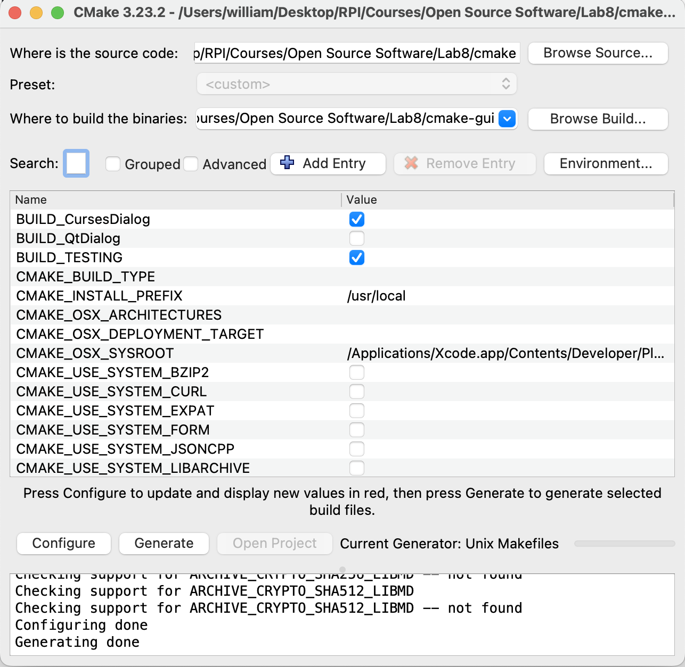
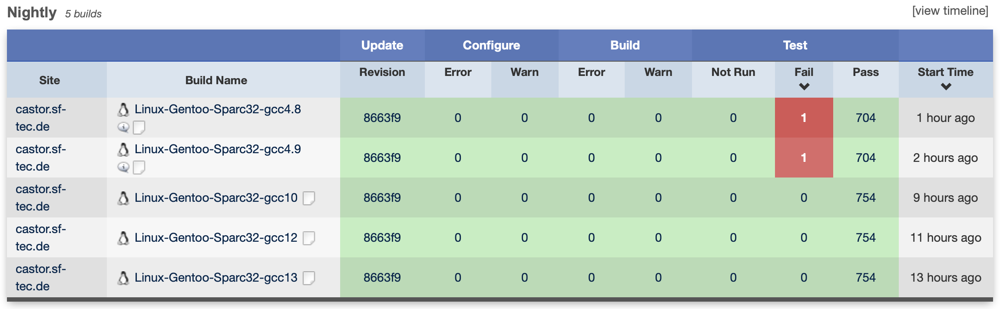
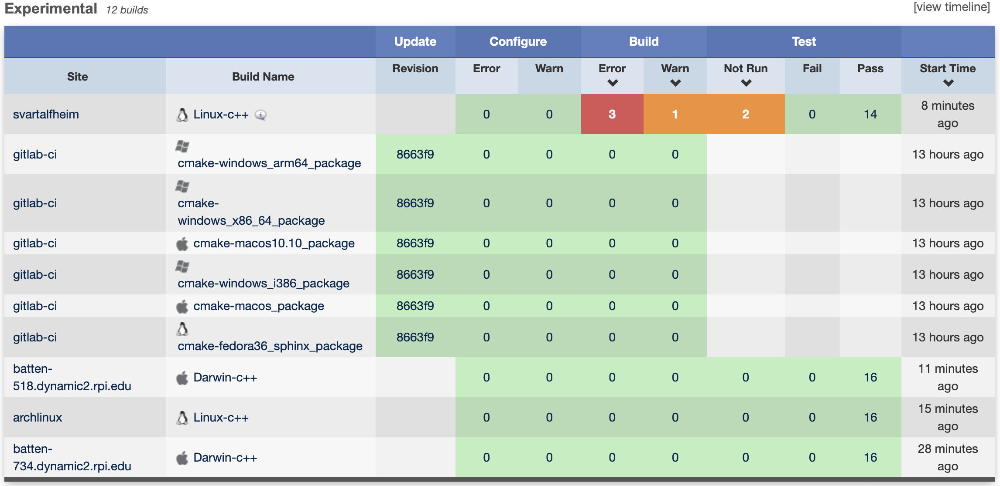
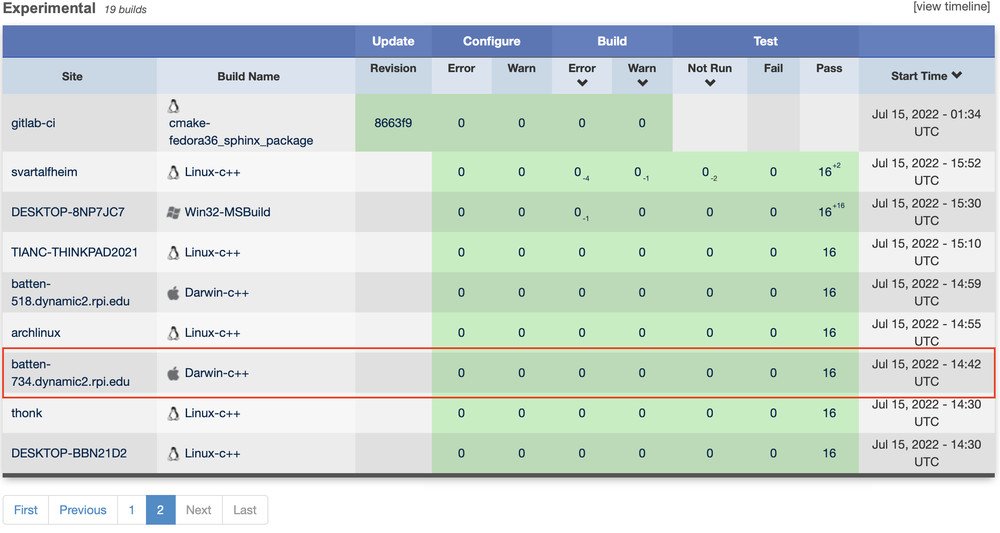
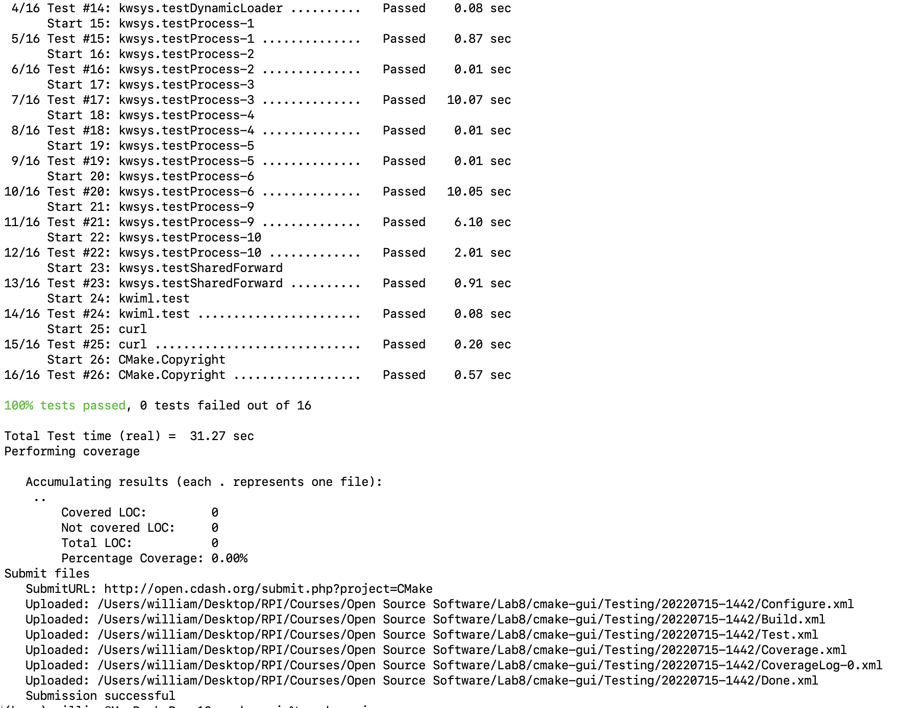
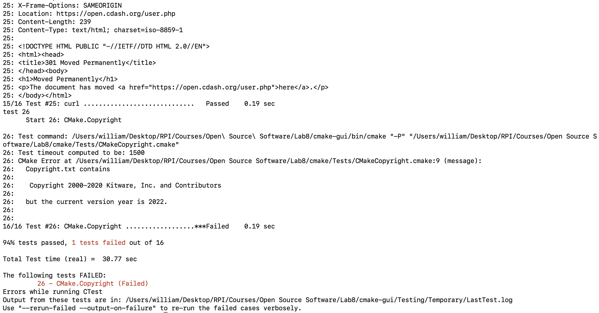
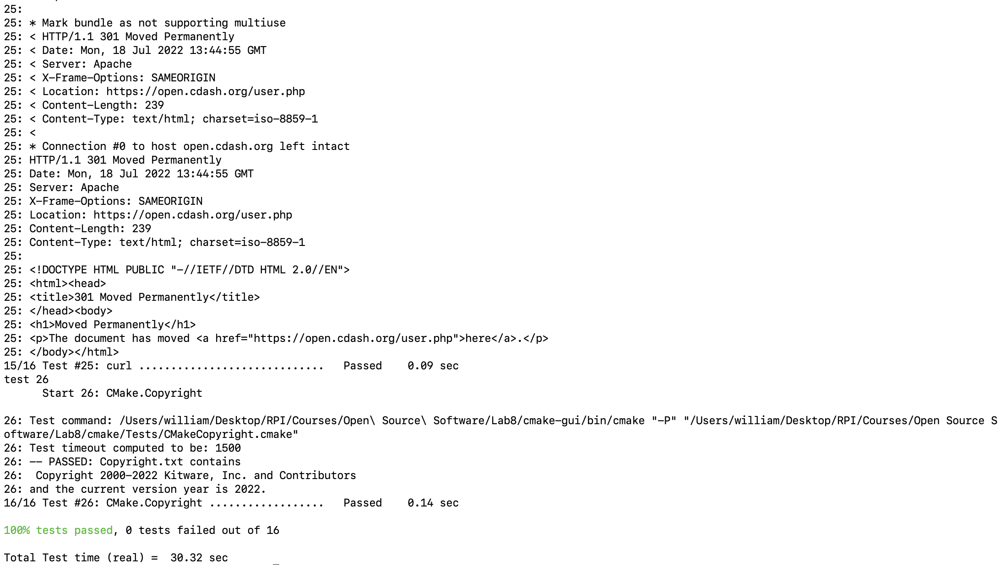
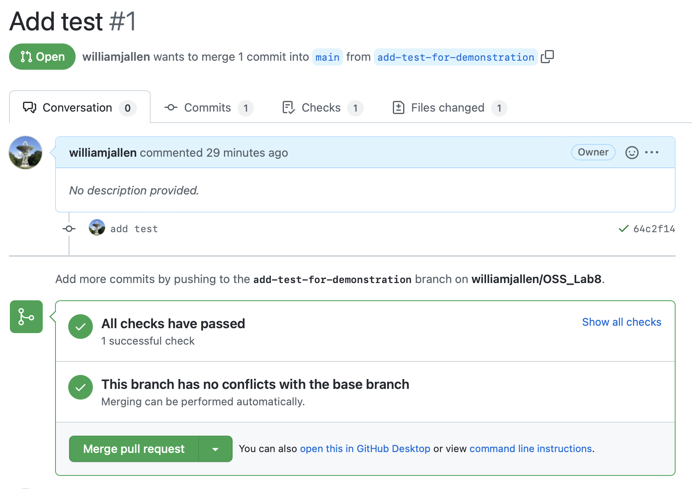
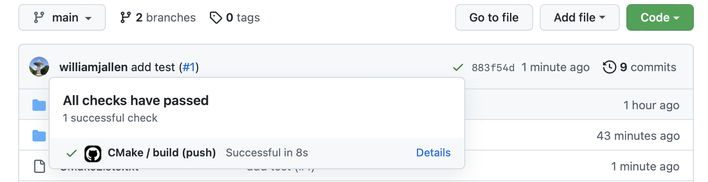

# Lab 8

## Checkpoint 1

## Checkpoint 2

While waiting for the tests to run, the Nightly and Experimental sections of the dashboard were identified and the following screenshots were collected.

It is possible to observe the tests run and their execution status by clicking on each test result.  In one of the [recent](https://open.cdash.org/viewBuildError.php?buildid=8041105) experimental builds, 3 errors occurred.  In the case of the aforementioned errors, they appear to be caused by a missing openssl configuration.  The error is on line 53 of `Utilities/cmcurl/lib/curl_ntlm_core.c`.

My test results were uploaded to CDash automatically and may be found [here](https://open.cdash.org/build/8041101).  No errors were reported, which is consistent with the results of other macOS runs around that same time frame.

## Checkpoint 3

The `Copyright.txt` file was overwritten by [this](https://github.com/rcos/CSCI-4470-OpenSource/blob/master/Modules/08.TestingAndCI/Kitware-modded-Copyright.txt) modified copyright file and the test suite was re-run.  The failing test may be seen below:

The test is failing because the copyright year is listed as 2000-2020 instead of 2000-2022.  After making the relevant change, all of the tests pass as shown in the screenshot below.

## Checkpoint 4

A [repository](https://github.com/williamjallen/OSS_Lab8) was created for this checkpoint to demonstrate proficiency with GitHub Actions.  The files from Module 5 of the CMake tutorial were copied into the repository and a default GitHub Action was used to make and test the project.  An additional test was created and the action was tested by making a pull request and then merging it.  Screenshots of the results are included below:

