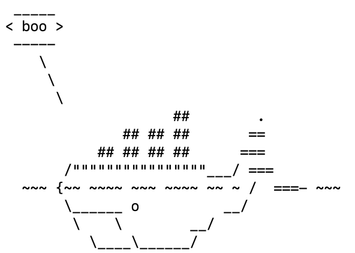

# Lab 9

## Example 00

Docker was installed and the [docker-examples](https://github.com/rcos/docker-examples) repository was cloned.  No problems arose during this process.  To show that Docker was working properly, the command `docker run docker/whalesay cowsay boo` was run and produced the following output.

## Example 01

After following the directions for this example, `cowsay` was successfully installed in the Docker container.  The following screenshot shows the result of running the `cowsay` command in the newly-created Docker container.

## Example 02

The directions for this example were followed and a local instance of RocketChat was set up.  The following screenshot shows the local RocketChat instance after a user account was created.  The docker images were then removed from my computer to save space via the command `docker images purge`.

## Example 03

The directions for this example were followed and a rudimentary Flask server was created.  The following screenshots show the working CLI of the Flask server as well as the output observed when accessing it in a web browser.

# Example 04

The specified Dockerfile was created and a corresponding image was built.  The command `docker run message-app` failed as expected due to a missing mongodb instance.

The specified changes were made to create a `docker-compose.yml` file.  The message app was successfully created by the command `docker-compose build` and run by the command `docker-compose up`.  The specified message commands were sent and the following screenshot was collected.
