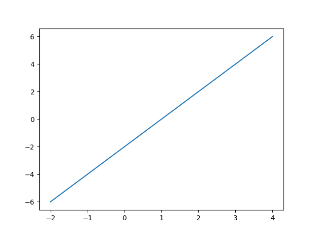
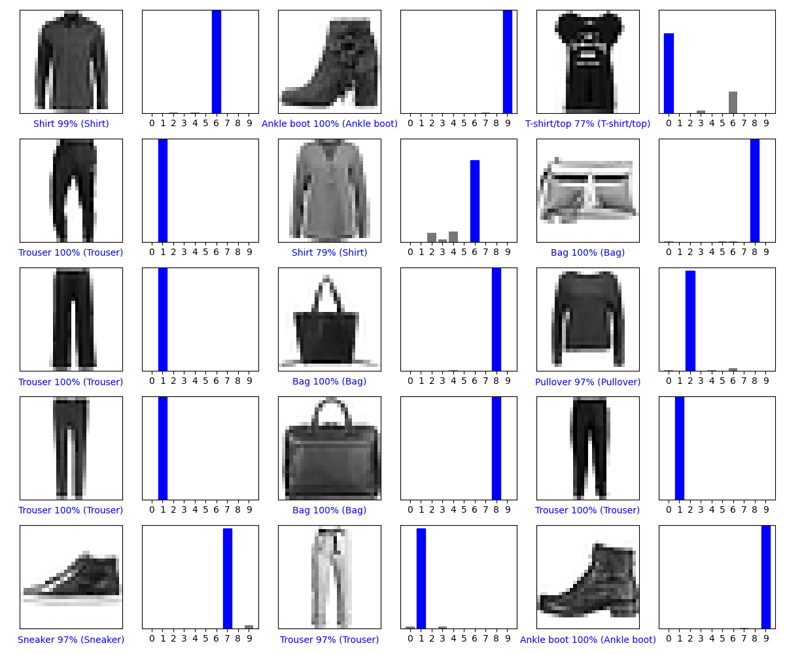
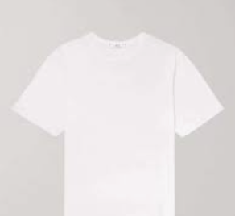
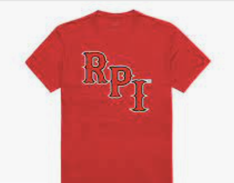

# Lab 11

## Checkpoint 1

The provided docker container was run with the command `docker run -it -p 8888:8888 -v $PWD/lab11:/home/tensorflow -e "DISPLAY"=host.docker.internal:0 wdturner/tensorflow_oss:latest`.  A basic Python file was created to test that everything worked as expected.  Instead of displaying a GUI, I changed it to save the following figure locally instead:


## Checkpoint 2

The required [tutorial](https://www.tensorflow.org/tutorials/keras/classification) was completed.  The specified edits were made to print information about images 9000-9014 instead of the original information about images 0-14.  The output image was as follows:


## Checkpoint 3

As per the instructions, I chose three images of shirts online to classify.  The shirts were cropped and scaled to a 28x28 square and converted to grayscale.  The following results were obtained:

### Shirt 1



```
Shirt 1: [[2.7951682e-02 1.7864794e-03 2.2620399e-02 1.7481603e-02 2.1697364e-03
  5.0073680e-02 1.6654871e-01 1.8159834e-04 7.0642722e-01 4.7588344e-03]] 8 Bag
```

### Shirt 2



```
Shirt 2: [[1.2729785e-01 5.0182400e-08 8.7438542e-03 2.4876517e-04 2.1289948e-04
  1.4010688e-03 5.2442819e-02 1.2968307e-04 8.0886179e-01 6.6120672e-04]] 8 Bag
```

### Shirt 3


```
Shirt 3: [[0.26565388 0.03281193 0.14388356 0.05991314 0.02793164 0.07908047
  0.21073733 0.04179143 0.11410975 0.02408694]] 0 T-shirt/top
```

Surprisingly, only one of the shirts was categorized properly.  Shirts 1 and 2 were improperly classified as bags.  This is potentially due to the fact that the cropping did not leave white space around each of the shirts.